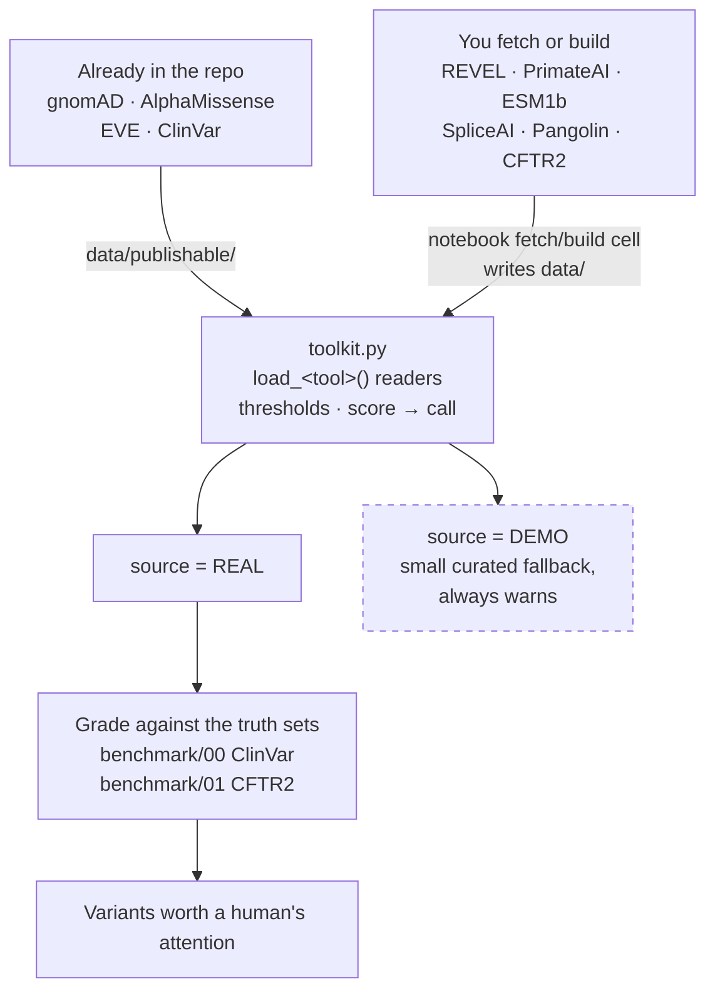

# CFTR Variant Toolkit


A beginner-friendly, **provenance-honest** walkthrough of the computational tools used to
interpret CFTR variants — the population-frequency reference, the missense pathogenicity
predictors, and the clinical and functional truth sets they get graded against.

Each tool gets one Jupyter notebook: **what it is → what the score means → the threshold and
why → how to get the real data**. More tools are in progress.

## About this project

I'm a healthcare data scientist who has spent nine years working with cystic fibrosis clinical
and genomic data. I built this because every time I reached for an in-silico predictor I had to
re-derive the same questions — what does this score actually mean, where did the threshold come
from, and can I fairly grade this tool against ClinVar if it trained on ClinVar? — and I could
not find one place that answered them honestly for CFTR specifically.

It is a **teaching reference, not a discovery**: it reproduces published results rather than
producing new ones. The contribution is the honest provenance labelling and the CFTR-specific
walkthrough.

## Data

**Four of the ten per-CFTR extracts ship with the repo** and load with no setup — gnomAD
(ODbL+MIT), AlphaMissense (CC BY 4.0), EVE (MIT) and ClinVar (CC0), all in
[`data/publishable/`](data/publishable/LICENSES.md) with per-file attribution.

Six may **not** be redistributed, so their notebooks show you how to fetch or build them
yourself: **REVEL** (non-commercial), **PrimateAI** (Illumina "research use only"), **ESM1b**
(scores are CC BY-NC, incompatible with this repo's MIT licence), **SpliceAI** (CC BY-NC 4.0),
**Pangolin** (non-commercial — you run the model rather than download a table) and **CFTR2**
(its terms forbid republishing any portion, including derived extracts). Until you build those, their loaders
return a small **DEMO** table and say so — every dataframe carries a `source` column reading
`REAL` or `DEMO`, and `strict=True` raises instead of falling back. **Never quote a DEMO value
as a finding.**

Per-dataset sources, versions, checksums and licences are in
[`data_manifest.json`](data_manifest.json); build instructions are in
[`data/README.md`](data/README.md).

## Quick tour

Read in this order — problem, then backbone, then tools, then truth:

1. **[`benchmark/00_clinvar.ipynb`](benchmark/00_clinvar.ipynb)** — the problem. **41% of CFTR's
   ClinVar records are "Uncertain significance."** That pile of VUS is *why* predictors exist.
2. **[`tools/01_gnomad.ipynb`](tools/01_gnomad.ipynb)** — the variant backbone, and a classifier
   in its own right: a common variant is rarely a rare-disease allele. Read this before the
   predictor notebooks — they join onto it via `load_gnomad_missense()`.
3. **[`tools/02_alphamissense.ipynb`](tools/02_alphamissense.ipynb)** — one predictor end to
   end: fetch, score, threshold, interpret.
4. **[`tools/05_revel.ipynb`](tools/05_revel.ipynb)** — the catch. Grading a predictor against
   labels it trained on is rigged; §2 works through what that does to REVEL-vs-ClinVar.
5. **[`benchmark/01_cftr2.ipynb`](benchmark/01_cftr2.ipynb)** — functional truth, and why even
   CFTR2 is only *partly* orthogonal to ClinVar.
6. **[`tools/07_spliceai.ipynb`](tools/07_spliceai.ipynb)** — the blind spot. Every predictor
   above is a *missense* predictor; CFTR's deep-intronic and synonymous disease alleles need a
   splice model instead.

If you only have five minutes, read **`benchmark/00`**.



DEMO is a dead end on purpose: it exists so a notebook still runs without licensed data, never
so a demo number reaches a result. See [`docs/architecture.md`](docs/architecture.md) for the
annotated version.

> ### ⚠️ A predictor score is not a clinical diagnosis
> Every threshold here (AlphaMissense ≥ 0.564, REVEL ≥ 0.75, …) is a deliberately simple
> single cut-point for building **teaching worklists** — variants worth a human's attention.
> They are **not** ACMG classifications and **not** diagnoses. Real clinical use applies
> *graded* thresholds and several independent lines of evidence (Pejaver 2022).
> `score ≥ cutoff` ≠ "pathogenic".

## Notebooks

### `tools/` — one predictor per notebook

| # | Notebook | Covers | Data |
|---|---|---|---|
| 01 | [`01_gnomad.ipynb`](tools/01_gnomad.ipynb) | gnomAD — population frequency as a classifier | ✅ included |
| 02 | [`02_alphamissense.ipynb`](tools/02_alphamissense.ipynb) | AlphaMissense — genome-wide missense predictor | ✅ included |
| 03 | [`03_eve.ipynb`](tools/03_eve.ipynb) | EVE — unsupervised evolutionary model | ✅ included |
| 04 | [`04_esm1b.ipynb`](tools/04_esm1b.ipynb) | ESM1b — protein language model (scale runs backwards) | ⬇ build it |
| 05 | [`05_revel.ipynb`](tools/05_revel.ipynb) | REVEL — supervised ensemble, and **circularity** | ⬇ build it |
| 06 | [`06_primateai.ipynb`](tools/06_primateai.ipynb) | PrimateAI — semi-supervised, near-saturating | ⬇ build it |
| 07 | [`07_spliceai.ipynb`](tools/07_spliceai.ipynb) | SpliceAI — splice deltas, and what "masked" costs | ⬇ build it |
| 08 | [`08_pangolin.ipynb`](tools/08_pangolin.ipynb) | Pangolin — a second splice model, and how independent it isn't | ⬇ build it |
| 09 | [`09_cadd.ipynb`](tools/09_cadd.ipynb) | CADD — one score across every variant class, live API | 🌐 live |

### `benchmark/` — the truth sets tools get graded against

| # | Notebook | Covers | Data |
|---|---|---|---|
| 00 | [`00_clinvar.ipynb`](benchmark/00_clinvar.ipynb) | ClinVar — crowd-sourced clinical assertions | ✅ included |
| 01 | [`01_cftr2.ipynb`](benchmark/01_cftr2.ipynb) | CFTR2 — disease-specific functional truth set | ⬇ build it |

## Setup

One script builds an isolated `.venv`, installs everything, registers a Jupyter kernel,
and then **verifies** it — importing every package the notebooks use and every module in
the repo, rather than assuming the install worked:

```powershell
.\setup_env.ps1
```

Add `-SkipPangolin` to skip PyTorch and the Pangolin model package (~250 MB, needed only
by `tools/08`), or `-Cuda cu124` for a GPU build. Then pick the **Python (CFTR toolkit)**
kernel in Jupyter.

Prefer to do it by hand, or not on Windows:

```bash
python -m venv .venv && . .venv/bin/activate
pip install -r requirements.txt                                    # tools/01–07, benchmark/00–01
pip install torch --index-url https://download.pytorch.org/whl/cpu # tools/08 only
pip install -r requirements-pangolin.txt                           # tools/08 only, needs git
jupyter lab
```

Install torch *before* `requirements-pangolin.txt` — the Pangolin package imports it
while building.

Open [`benchmark/00_clinvar.ipynb`](benchmark/00_clinvar.ipynb) first. The four included
datasets work immediately; the other six print a build recipe when you first load them.

Run everything headless:

```bash
for dir in tools benchmark; do (cd "$dir" && for nb in *.ipynb; do jupyter nbconvert --to notebook --execute --inplace --ExecutePreprocessor.kernel_name=cftr-toolkit "$nb"; done); done
```

`--ExecutePreprocessor.kernel_name` is not optional if you used `setup_env.ps1`. The
notebooks declare the portable `python3` kernelspec, and `nbconvert` launches *that*
kernel rather than the interpreter you invoked it with — so without the flag `tools/08`
fails with `No module named 'torch'` even from inside an activated `.venv`. Selecting
**Python (CFTR toolkit)** in Jupyter Lab does the same thing interactively.

## Files

```
cftr-variant-toolkit/
├── toolkit.py            ← shared core: thresholds, tool registry, score→call logic,
│                           DEMO panel, thin load_<tool>() readers. Each dataset's
│                           fetch/build code lives in its own notebook, not here.
├── verify_data.py        ← checks locally built extracts against data_manifest.json
├── data_manifest.json    ← source, version, checksum and licence for every dataset
├── docs/architecture.md  ← how a public source becomes a worklist (diagram)
├── tools/                ← 01–09, committed with outputs
│   ├── spliceai_build.py ← tabix/bgzf plumbing for 07 (pysam won't build on Windows)
│   └── pangolin_build.py ← model loading + scoring for 08. The only two build helpers
│                           outside a notebook; both committed and imported in view.
│                           The _build suffix stops them shadowing the PyPI packages
│                           of the same name when run from tools/
├── benchmark/            ← 00–01, committed with outputs
└── data/                 ← gitignored except:
    ├── README.md         ← fetch/build guide
    └── publishable/      ← the 4 shareable extracts + LICENSES.md
```

## Limitations, and what this is not

**We reproduce, not discover.** Aggregating predictors and cross-checking them against
ClinVar/CFTR2 is well established — **OpenCRAVAT/OakVar**, **dbNSFP**, Ensembl **VEP** and its
plugins all do it at scale. Published CFTR-specific results this material follows include
McDonald et al. 2023 (*PLOS ONE*, AlphaMissense's false-positive rate against CFTR2), Tordai et
al. 2024 (*Sci Data*), Bergougnoux et al. 2022 (*J Cyst Fibros*), and the ACMG CFTR standard
(Deignan et al. 2021, *Genet Med*).

**No temporal hold-out.** None of these notebooks apply a training-cutoff hold-out, so a
variant described decades before a model existed (F508del, 1989) may be scored correctly from
memorisation rather than understanding. `tools/05` §2 explains why that matters and what a
defensible benchmark would need.

**Truth sets are not independent of each other.** CFTR2 cross-cites ClinVar and informs the
ACMG CFTR guidance ClinVar submitters follow, so "agrees with CFTR2" is only *partially*
orthogonal evidence.

**ClinVar drifts by design.** It republishes roughly weekly. The shipped snapshot is pinned by
its `clinvar_release` column; re-fetching will legitimately change counts, and
`benchmark/00` can pin a specific `YYYY-MM` from NCBI's monthly archive instead.

**The curated DEMO splice panel has hand-entered coordinates**, several of which do not match
the GRCh38 reference, and one VUS (`c.2657+120C>T`) is an explicitly synthetic teaching
example. It is a teaching fixture, not data.

## References

gnomAD v4 (Karczewski 2020, *Nature*) · ClinVar (Landrum 2018, *NAR*) · CFTR2
([cftr2.org](https://cftr2.org)) · AlphaMissense (Cheng 2023, *Science*) · EVE (Frazer 2021,
*Nature*) · ESM1b (Brandes 2023, *Nat Genet*) · REVEL (Ioannidis 2016, *AJHG*) · PrimateAI
(Sundaram 2018, *Nat Genet*) · SpliceAI (Jaganathan 2019, *Cell*) · Pangolin (Zeng & Li 2022,
*Genome Biol*) · REVEL ACMG calibration (Pejaver 2022, *AJHG*) · ACMG/AMP
guidelines (Richards 2015, *Genet Med*).
