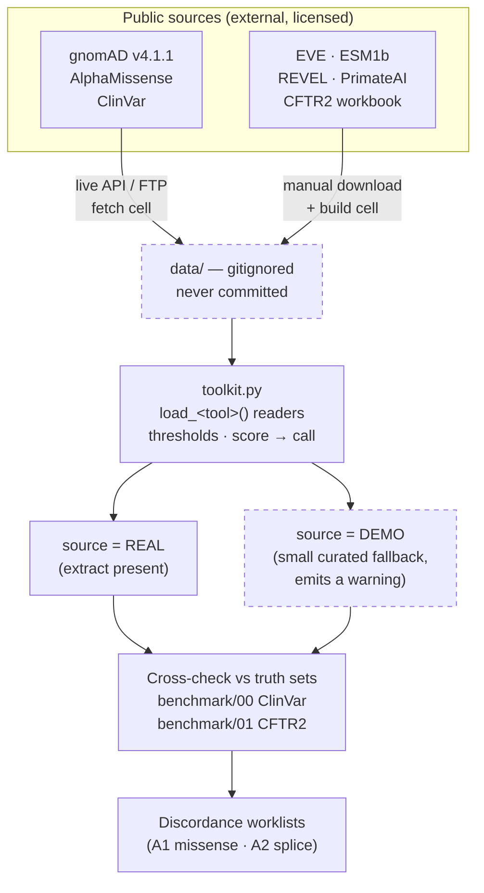

# CFTR Variant Toolkit


A beginner-friendly, **provenance-honest** walkthrough of the computational tools
used to interpret CFTR variants — the missense pathogenicity predictors, the
population-frequency reference, and the clinical/functional truth sets. Built as a
teaching companion to the project's A1 (missense triage) and A2 (splice
discordance) analyses.

Each tool gets its own Jupyter notebook explaining **what it is → what the score
means → the threshold and why → how to get the real data**.

## About this project

I'm a healthcare data scientist who has spent nine years working with cystic
fibrosis clinical and genomic data. I built this because every time I reached for an
in-silico predictor I had to re-derive the same questions — what does this score
actually mean, where did the threshold come from, and can I fairly grade this tool
against ClinVar if it trained on ClinVar? — and I could not find one place that
answered them honestly for CFTR specifically.

It is a **teaching reference, not a discovery**. The analyses here reproduce
published CFTR results (see [Related work](#related-work--we-reproduce-not-discover));
the contribution is the explicit REAL/DEMO provenance labelling and the CFTR-specific
walkthrough, not new biology.

---

> ## 📦 Data is NOT included in this repo
> This repository ships **code + notebooks + a data manifest only**.
> Every dataset (raw sources *and* the derived per-CFTR score extracts) is
> license-restricted / non-commercial — REVEL non-commercial, **PrimateAI "research
> use only"**, AlphaMissense CC BY 4.0, EVE MIT, CFTR2 data-use terms — and is **not
> redistributed here**. Regenerate each extract yourself by running the fetch/build
> cell in that tool's own notebook (some query a live API directly; others need a file
> you download by hand — the notebook tells you exactly which); `data_manifest.json`
> lists the exact source, version, and checksum.
> Committed notebooks keep their outputs so you can *read* the results; to *re-run*,
> fetch the data first.

## 🚀 Quick tour

If you are reviewing this repo and have five minutes, read
**[`tools/05_revel.ipynb`](tools/05_revel.ipynb)** then
**[`benchmark/01_cftr2.ipynb`](benchmark/01_cftr2.ipynb)** — together they contain the
one idea the whole toolkit is built around: you cannot fairly grade a predictor
against labels it was trained on.

A longer path, in order:

1. **[`tools/01_gnomad.ipynb`](tools/01_gnomad.ipynb)** — population frequency is
   itself a variant classifier, and the best one for ruling variants *out*.
2. **[`tools/02_alphamissense.ipynb`](tools/02_alphamissense.ipynb)** — one modern
   predictor end to end: fetch, score, threshold, interpret.
3. **[`benchmark/01_cftr2.ipynb`](benchmark/01_cftr2.ipynb)** — what "ground truth"
   means here, and why CFTR2's functional assays are only *partially* orthogonal.
4. **[`tools/05_revel.ipynb`](tools/05_revel.ipynb)** — the circularity problem, worked
   through on the tool most affected by it.
5. **[The count glossary](#count-glossary--every-number-in-one-place)** — every headline
   number in this README, what it actually counts, and whether it is current.



The dashed boxes are the two things that make this repo unusual: **no data ever
crosses into git**, and **every returned table is labelled REAL or DEMO** so a demo
value can never be quoted as a finding. See
[`docs/architecture.md`](docs/architecture.md) for the annotated version.

## ⚠️ Read this first: REAL vs DEMO — and what a fresh clone ships

Two things matter most about this toolkit. First, which numbers come from *real*
data and which come from small *hand-curated demo tables*. Second — and just as
important — **this repo ships no data at all.** `data/` and `outputs/` are
gitignored, so "REAL" below means *what a loader returns once you have run its
notebook's fetch/build cell*, **not** what you get on `git clone`.

| Source | REAL once you… | Coverage (once built) | Fresh clone gives you | Notebook |
|---|---|---|---|---|
| gnomAD v4.1.1 (allele freq) | run the fetch cell (live query) | ~2,466 missense / ~4,717 non-coding / ~394 other-coding | ❌ `FileNotFoundError` | tools/01 |
| **AlphaMissense** | run the fetch cell (live query) | genome-wide CFTR missense | ❌ `FileNotFoundError` | tools/02 |
| ClinVar | run the fetch cell (live query) | genome-wide | ❌ `FileNotFoundError` | benchmark/00 |
| **CFTR2** (30 Jan 2026) | run the build cell (manual download) | ~2,097 variants / ~780 missense keys | ⚠️ DEMO fallback | benchmark/01 |
| **EVE** | run the build cell (manual download) | ~26,809 CFTR variants | ⚠️ DEMO fallback | tools/03 |
| **ESM1b** | run the build cell (manual download) | ~28,120 CFTR (saturation) | ⚠️ DEMO fallback | tools/04 |
| **REVEL** | run the build cell (manual download) | ~10,127 CFTR (coord-keyed; non-commercial) | ⚠️ DEMO fallback | tools/05 |
| **PrimateAI** | run the build cell (manual download) | ~9,722 CFTR (native Illumina release; research use only) | ⚠️ DEMO fallback | tools/06 |

`toolkit.py` also ships readers for **SpliceAI**, **Pangolin** and **CADD**. Their
notebooks are [not yet published](#not-yet-published) — the loaders work, the
teaching material is still in audit.

There are **three** states, not two:

- **Live-fetched REAL** (gnomAD, AlphaMissense, ClinVar) — the notebook's fetch cell
  queries a public API/bulk file directly; the loader **raises `FileNotFoundError`**
  until you've run it once. No demo fallback.
- **Manual-download REAL** (CFTR2, EVE, ESM1b, REVEL, PrimateAI) — the notebook's
  build cell tells you exactly what to download and where to put it in `data/`, then
  parses it; until then the loader **falls back to a small DEMO table**
  (`source='DEMO'`) *with a warning*. Pass `strict=True` to raise instead of degrading
  silently.
- **Live** — CADD is a live API (cache the responses for reproducibility).

CFTR2 and ClinVar are real *truth sets* (databases), not predictors. Every DataFrame
a loader returns carries a `source` column (`REAL` / `DEMO`) so the two are never
confused. **Never quote a DEMO value as a finding.**

> ### 📍 Current status in *this* checkout
> This repo ships **code + notebooks + manifest only** — no data.
> On a clean clone: the three live-fetched loaders raise `FileNotFoundError`; the
> manual-download loaders return `source='DEMO'` (with a warning) until you
> run their notebook's build cell. See **[`data/README.md`](data/README.md)** for
> exactly how to fetch and build each extract, and
> **[`data_manifest.json`](data_manifest.json)** for the source URL, version,
> checksum, and license of every dataset.

---

## 🔰 Beginner primer (read before the numbers)

New to CFTR or variant prediction? These notes unlock the rest of the README.

**Variant vocabulary.** A gene is read in three-letter codons that spell out a
protein. A **missense** variant changes one amino acid; a **synonymous** variant
changes the DNA but *not* the amino acid (yet can still disrupt splicing); a
**splice** variant hits the signals that cut introns out and join exons together; a
**deep intronic** variant sits far inside an intron but can create a *cryptic* splice
site; **non-coding** is the umbrella for everything that isn't a protein-coding
change (intronic, UTR, splice-region, synonymous). The A1 analysis is about
missense; A2 is about splice/non-coding — the variants the missense tools can't see.

**Two ways variants are named, and why joins break.** CFTR variants travel under
several keys, and most "biological disagreements" are really key mismatches:

| Key type | Example | Where it's used | Gotcha |
|---|---|---|---|
| Protein (1-letter) | `G551D` | AlphaMissense, EVE, ESM1b, gnomAD `protein_variant` | only exists for missense |
| Protein (3-letter) | `Gly551Asp` | some curated tables, ClinVar `Name` | must convert to 1-letter to join (`three_to_one()` in `toolkit.py`) |
| HGVS coding | `c.1652G>A` | CFTR2, clinical reports | needs the MANE transcript (`NM_000492.4`) |
| Legacy CFTR name | `2789+5G>A` | CFTR2 history, older literature | no formula — kept as a lookup column |
| Genomic coordinate | `7-117587799-G-A` (`chrom,pos,ref,alt`) | REVEL, SpliceAI, CADD, gnomAD `variant_id` | **CFTR is on the plus strand**, so the genomic `ref/alt` is the *same* as the coding change (coding `c.1624G>T` shows as `G`/`T`) — don't complement; the real risk is joining on the wrong build or the wrong key |

REVEL is keyed by **coordinate** (no protein position), so it joins by
`chrom,pos,ref,alt` — mind the genome build. AlphaMissense/EVE/ESM1b join by
**protein_variant**. `hgvsp_to_short()` and `three_to_one()` in `toolkit.py` are the
helpers that normalise between them.

### Circularity

**Why "the predictor disagrees with ClinVar" isn't always evidence.**
Testing a predictor against labels it *trained on* is like grading a student with the
exact questions they studied — a high score proves memorisation, not understanding.
REVEL was trained on curated pathogenic/benign labels that share lineage with ClinVar,
so "REVEL vs ClinVar" is partly **circular**. AlphaMissense/EVE/ESM1b never saw
clinical labels, so comparing *them* to ClinVar is closer to independent evidence.

The same caution applies to the truth sets themselves: **CFTR2 is not independent of
ClinVar**. Its functional-assay axis is genuinely orthogonal, but its patient/clinical
component overlaps ClinVar's evidence, ClinVar entries cite CFTR2, and CFTR2 informs
the ACMG CFTR guidance ClinVar submitters follow. Use ClinVar for breadth and CFTR2's
*functional* measurements as **partial** orthogonal evidence — never as a
circularity-free gold standard.

A related trap is **temporal leakage**: a variant reported in 1989 (F508del, say) is
in the training data of every label-supervised tool built since, so "the tool got it
right" tells you nothing. A proper benchmark applies a training-cutoff hold-out. The
A1 worklist below did **not** do this — see [Known limitations](#known-limitations-by-design--honesty).

> ### ⚠️ A predictor score is not a clinical diagnosis
> Every threshold in this README (AlphaMissense ≥ 0.564, SpliceAI ≥ 0.5, …) is a
> deliberately simple single cut-point used to build **teaching worklists** — lists
> of variants worth a human's attention. They are **not** ACMG classifications and
> **not** diagnoses. Real clinical use applies *graded* thresholds and multiple lines
> of evidence (Pejaver 2022; tools/05). `score ≥ cutoff` ≠ "pathogenic".

---

## 📋 The one-page summary (A1 / A2)

This is the combined one-page summary these notebooks document — reproduced here
so a reader lands on the headline results and their source. Generated 2026-07-01
as part of a CFTR variant-interpretation collaboration.

> ### 🕰️ These are HISTORICAL / demo-reproduced numbers
> Everything in this "one-page summary" block (the Dashboard, the A1 discordance
> figure, and the Priority-1 table) reproduces the **original project webpage**,
> which was computed on a **~13-variant demo** footing before the real extracts
> existed. They are kept for provenance — *do not cite them as current results.*
> The **current real-data rerun** is the next section,
> **[“What the headline numbers actually mean”](#what-the-headline-numbers-in-the-summary-report-actually-mean)**,
> and the **[count glossary](#count-glossary--every-number-in-one-place)** maps each
> historical number to its corrected real value.

> ### 📓 A note on sources
> Several numbers below were computed by notebooks that are **written but not yet
> published in this repo** — they are still going through the audit pass that
> `tools/01–06` and `benchmark/00–01` have already been through. Those are marked
> *(pending audit)* rather than linked, because pointing you at a file you cannot
> open would be worse than saying so. See [Not yet published](#not-yet-published).

### Dashboard *(historical / demo — see banner above)*

| Block | Metric | Value |
|---|---|---|
| **A1 · Missense** | CFTR missense variants scored | **2,496** |
| **A1 · Discordant** | Predictor↔database disagreements | **413** |
| **A1 · Priority 1** | VUS, ≥3/5 tools pathogenic | **4** |
| **A2 · Splice** | Splice variants scored | **1,094** |
| **A2 · High impact** | HIGH SpliceAI (+1 MODERATE) | **7** |
| **A2 · VUS worklist** | VUS with high splice risk | **2** |
| **Total worklist** | Variants for expert curation | **415** |

### A1 — Missense VUS triage / predictor discordance

Every CFTR missense variant scored by five orthogonal predictors (AlphaMissense,
EVE, ESM1b, REVEL, PrimateAI), then cross-checked against its CFTR2 class and
ClinVar assertion → a **413-variant discordance worklist** where computational
evidence disagrees with the curated classification (403 upgrade + 10 downgrade
candidates; 0 reverse discordance).

*Pathogenic cutoffs:* AlphaMissense ≥ 0.564 · EVE ≥ 0.50 · ESM1b ≤ −7.5 · REVEL ≥ 0.75 · PrimateAI ≥ 0.803.

**Priority 1 — VUS but ≥3/5 tools predict pathogenic** (primary upgrade candidates):

| Variant | HGVS c. | CFTR2 | ClinVar | AM | EVE | ESM1b | REVEL | PAI | Votes |
|---|---|---|---|---|---|---|---|---|---|
| **Tyr161Cys** | c.482A>G | VUS | Uncertain | 0.891 | 0.832 | −7.20 | 0.872 | 0.841 | **4/5** |
| **Gly970Asp** | c.2909G>A | VUS | Uncertain | 0.831 | 0.773 | −6.40 | 0.812 | 0.782 | **3/5** |
| **Ser912Leu** | c.2735C>T | VUS | Uncertain | 0.805 | 0.742 | −6.20 | 0.782 | 0.751 | **3/5** |
| **Val520Phe** | c.1558G>T | VUS | Uncertain | 0.778 | 0.718 | −6.00 | 0.755 | 0.731 | **3/5** |

> **Update (real EVE):** with EVE now real, **S912L scores benign (0.085)** and drops
> out, so the honest ≥3/5 count is **3, not 4** *(archived integration notebook, not
> published)*. The `4` above is the original webpage's demo-based figure, kept here as
> the reproduced summary. You can verify the S912L score yourself in
> [`tools/03_eve.ipynb`](tools/03_eve.ipynb).

> With the **real CFTR2** loader ([`benchmark/01`](benchmark/01_cftr2.ipynb)) now
> available, you can compute a fully real upgrade set: **256** variants that CFTR2 calls
> *"No interpretation available"* or *"Varying clinical consequence"* while AlphaMissense
> scores ≥ 0.564.

Source: the archived integration notebook (`archive/`, gitignored) wrote this worklist as
`outputs/A1_upgrade_worklist_REAL.csv` (real AlphaMissense-vs-ClinVar upgrades). **That
file no longer exists** — `outputs/` is gitignored. Treat the numbers above as historical.

### A2 — Splice-variant discordance

Deep-intronic, synonymous, and splice-site CFTR variants scored with SpliceAI +
Pangolin delta scores and CADD-Splice PHRED — **invisible to the A1 missense
tools** — then cross-checked against CFTR2/ClinVar. *Thresholds:* SpliceAI/Pangolin
DS_max ≥ 0.5 = HIGH, ≥ 0.2 = MODERATE; CADD-PHRED ≥ 15 = top 3%.

**Splice-risk VUS (primary worklist):**

| Variant | Type | SpliceAI | Pangolin | CADD | Tier |
|---|---|---|---|---|---|
| c.2657+120C>T † | deep intronic | 0.540 | 0.510 | 17.9 | HIGH |
| IVS8 5T (c.1210-34TG(12)T(5)) | deep intronic | 0.310 | 0.220 | 0.0 | MODERATE |

> **† `c.2657+120C>T` is a synthetic teaching example**, not a confirmed real
> observation, and all scores in this table are `source=DEMO` (hand-authored, not a
> real SpliceAI/Pangolin run). Do not treat this row as a real patient or database
> variant.

**Known CF splice variants (positive controls)** — any real SpliceAI/Pangolin run
should recover HIGH here: 2988+1G>A, 2789+5G>A, 2657+3A>G, 3849+10kb C>T,
3272-26A>G, 1811+1.6kb A>G.

Source: the archived integration notebook (`archive/`, gitignored) wrote this as
`outputs/A2_splice_DEMO.csv`, all rows `source=DEMO`. **That file no longer exists** —
`outputs/` is gitignored. The real-data version of this question lives in the splice
notebooks, *pending audit*.

---

## What the headline numbers in the summary report actually mean

> ### ✅ These are the CURRENT real-data rerun numbers
> Computed *with the real extracts built*. Where they differ from the historical block
> above, **these are the ones to cite.** Numbers marked *(pending audit)* come from
> notebooks not yet published here — see [Not yet published](#not-yet-published).
> (Reproduce them yourself only after building the extracts — see
> [`data/README.md`](data/README.md).)

The earlier one-page summary reported the historical `2496 / 413 / 403 / 10 / 4 / 1094`.
Here is what each one actually is, and its corrected real value:

- **2,496 → 2,466.** The real gnomAD v4.1.1 CFTR missense backbone is **2,466** variants
  ([`tools/01`](tools/01_gnomad.ipynb)); the historical **2,496** added ~30 hand-curated
  famous alleles (G551D, …). Of the 2,466, **2,430** have an AlphaMissense score and
  **2,437** have ≥1 real predictor.
- **413 = 403 + 10 → 402 = 392 + 10.** This is a **two-source comparison —
  AlphaMissense vs ClinVar** (AM pathogenic while ClinVar is uncertain = *upgrade*, or
  AM benign while ClinVar is pathogenic = *downgrade*), **not** a five-tool vote. The
  live rerun over real data gives **392 upgrade + 10 downgrade = 402** *(archived
  integration notebook, not published)*; the historical `403/10/413` was the webpage's
  figure and drifts by a few with the ClinVar release used.
- **4 → 473.** "VUS but ≥3/5 tools pathogenic" was a demo-only figure (≥3/5 over ~13
  demo variants; it becomes **3** once real EVE drops S912L). With the real missense
  extracts built, the consensus runs over the **2,466 observed** variants and the real
  A1 Priority-1 worklist is **473** *(archived integration notebook, not published)*.
  (PrimateAI covers only ~53% of sites, so some variants are voted by 4 tools not 5;
  REVEL/PrimateAI carry circularity — see [Circularity](#circularity).)
- **1,094 → 4,535 / 173 HIGH.** "1,094 splice variants scored" originally meant **9
  demo variants** (the other ~1,085 unscored). With the real SpliceAI extract built,
  **4,535 of the 4,717** observed gnomAD non-coding CFTR variants get a real SpliceAI
  score, of which **173 are HIGH-impact** (≥0.5) and 86 MODERATE — the real A2 worklist.
  (Was 4,260 / 164 before the indel scores were included.) *(SpliceAI and Pangolin
  notebooks pending audit.)*

### Count glossary — every number in one place

Every headline number that appears in this README, what it actually counts, and
whether it is current or historical. "Source" points at where it is computed;
*pending audit* means the computing notebook is written but not yet published here.

| Number | What it counts | Status | Source |
|---|---|---|---|
| **2,466** | gnomAD v4.1.1 CFTR **missense** variants (no PASS/AC filter) — the real backbone | ✅ current | tools/01; `gnomad_all.rows` (`gnomad_class=='missense'`) |
| 2,177 | subset of those that are PASS in gnomAD's `joint_filters` (stricter view; live-computed in tools/01, not the same cut as the browser's default) | ✅ current (alt filter) | manifest note |
| 2,430 / 2,437 | of the 2,466: have an AlphaMissense score / have ≥1 real predictor | ✅ current | archived integration nb (not published) |
| **2,496** | 2,466 + ~30 hand-curated famous alleles injected by the original script | 🕰️ historical | archived integration nb (not published) |
| **413** = 403 + 10 | AlphaMissense-vs-ClinVar discordance on the **original webpage** | 🕰️ historical | webpage |
| **402** = 392 + 10 | same comparison on the **current real rerun** (upgrade + downgrade) | ✅ current | archived integration nb (not published) |
| **473** | observed VUS with ≥3/5 tools pathogenic — the real A1 Priority-1 worklist | ✅ current | archived integration nb (not published) |
| 4 / 3 | historical Priority-1 (≥3/5 over ~13 demo variants; 3 after real EVE drops S912L) | 🕰️ historical/demo | webpage / archived nb |
| 256 | CFTR2 "no interpretation" or "varying consequence" **and** AM ≥ 0.564 (fully-real upgrade set) | ✅ current | benchmark/01 + circularity reference (pending audit) |
| **1,085** | older stated gnomAD non-coding count | 🕰️ stale | old table |
| **4,717** | gnomAD v4.1.1 CFTR **non-coding** variants (intron + synonymous + UTR + splice-region) | ✅ current | tools/01; `gnomad_all.rows` (`gnomad_class=='noncoding'`) |
| **1,094** | historical "splice variants scored" (really 9 DEMO scored + ~1,085 unscored) | 🕰️ historical/demo | webpage |
| **4,535 / 4,717** | non-coding variants that get a **real SpliceAI** score (was 4,260 pre-indels) | ✅ current | SpliceAI notebook (pending audit) |
| **173 / 86** | of those 4,535: real SpliceAI HIGH (≥0.5) / MODERATE (0.2–0.5) | ✅ current | SpliceAI notebook (pending audit) |
| **2.08M** (2,075,730) | all precomputed SpliceAI CFTR records in the built extract: 566,106 SNVs (masked) + 1,509,624 indels (raw) | ✅ current | SpliceAI notebook (pending audit) |
| 9 | hand-curated DEMO splice variants (the A2 teaching table) | 🟡 DEMO | `toolkit.py` |

Coverage counts for the built extracts (saturation unless noted): EVE ~26,809 ·
ESM1b ~28,120 · REVEL 10,826 raw (9,730 canonical-transcript-only, verified saturating —
tools/05) · PrimateAI ~9,722 (native Illumina release, near-saturating — tools/06) ·
CFTR2 ~2,097.

---

## Notebooks

### `tools/` — one predictor per notebook

| # | File | Covers | Data on a fresh clone |
|---|---|---|---|
| 01 | [`tools/01_gnomad.ipynb`](tools/01_gnomad.ipynb) | gnomAD — population frequency as a variant classifier in its own right | REAL if cached, else error |
| 02 | [`tools/02_alphamissense.ipynb`](tools/02_alphamissense.ipynb) | AlphaMissense — genome-wide missense predictor | REAL if cached, else error |
| 03 | [`tools/03_eve.ipynb`](tools/03_eve.ipynb) | EVE — unsupervised evolutionary model | REAL if built, else DEMO |
| 04 | [`tools/04_esm1b.ipynb`](tools/04_esm1b.ipynb) | ESM1b — protein language model (backwards scale) | REAL if built, else DEMO |
| 05 | [`tools/05_revel.ipynb`](tools/05_revel.ipynb) | REVEL — supervised ensemble + **circularity** | REAL if built, else DEMO |
| 06 | [`tools/06_primateai.ipynb`](tools/06_primateai.ipynb) | PrimateAI — semi-supervised (near-saturating) | REAL if built, else DEMO |

### `benchmark/` — the truth sets tools get graded against

| # | File | Covers | Data on a fresh clone |
|---|---|---|---|
| 00 | [`benchmark/00_clinvar.ipynb`](benchmark/00_clinvar.ipynb) | ClinVar — crowd-sourced clinical truth set | REAL if cached, else error |
| 01 | [`benchmark/01_cftr2.ipynb`](benchmark/01_cftr2.ipynb) | CFTR2 — disease-specific functional truth set | REAL if built, else DEMO |

**Recommended order:** `tools/01` → `tools/02` → `benchmark/00–01` → `tools/03–06`.
Read `tools/01` first: it is the only notebook that is about *observed* variants rather
than predicted ones, and it sets up the variant backbone every other notebook joins onto.

## Not yet published

Five notebooks are written and working locally but are **held back pending the same
audit pass** `tools/01–06` and `benchmark/00–01` have been through. They are listed
here rather than quietly omitted, because several numbers in this README came from
them:

| Notebook | Covers | Why it matters to the numbers above |
|---|---|---|
| `tools/00` | setup + the provenance map | orientation only |
| `tools/07` | **SpliceAI** — splice deltas across all CFTR SNVs and indels | source of 4,535 / 173 / 86 / 2.08M |
| `tools/08` | **Pangolin** — independent splice model, run locally | the A2 cross-check |
| `tools/09` | **CADD** — live deleteriousness API | the A2 PHRED column |
| `tools/10` | **circularity & temporal-leakage reference** | the argument summarised under [Circularity](#circularity) |
| `predict/13` | all tools vs the whole CFTR2 list — coverage + per-tool performance | the coverage/performance framing |

`toolkit.py` still ships `load_spliceai()`, `load_pangolin()` and the CADD helpers, so
the library covers these tools even though the teaching notebooks don't yet. Each will
be published as it clears audit.

---

## The tools at a glance

| Tool | Type | Score → pathogenic | Learns from clinical labels? | Paper |
|---|---|---|---|---|
| **AlphaMissense** | missense | ≥ 0.564 | No (sequence/structure) | Cheng 2023, PMID 37733863 |
| **EVE** | missense | ≥ 0.50 | No (MSA) | Frazer 2021, PMID 34707284 |
| **ESM1b** | missense | LLR ≤ −7.5 | No (protein LM) | Brandes 2023, PMID 37563329 |
| **PrimateAI** | missense | ≥ 0.803 | Proxy (primate/common) | Sundaram 2018, PMID 30038395 |
| **REVEL** | missense | ≥ 0.75 (graded) | **Yes (HGMD+ESP)** ⚠ | Ioannidis 2016, PMID 27666373 |
| **SpliceAI** * | splice | DS_max ≥ 0.5 | No (GTEx junctions) | Jaganathan 2019, PMID 30661751 |
| **Pangolin** * | splice | ≥ 0.5 | No | Zeng & Li 2022, PMID 35449021 |
| **CADD** * | general | PHRED ≥ 15 | Proxy | Rentzsch 2021, PMID 33618777 |

\* loader ships in `toolkit.py`; teaching notebook [pending audit](#not-yet-published).

⚠ REVEL is the one to distrust when benchmarking against ClinVar (it may have
trained on the same labels). Note ESM1b runs the *opposite* direction — more
negative = more damaging. All thresholds are single-cut simplifications; the ACMG
calibration (Pejaver 2022, PMID 36413997) uses *graded* thresholds — see tools/05.

---

## Setup

```bash
pip install -r requirements.txt
# then, from this folder:
jupyter lab           # or: jupyter notebook
```

Open [`tools/01_gnomad.ipynb`](tools/01_gnomad.ipynb) first.

### The REAL loaders need data you fetch/build yourself

**Nothing under `data/` or `outputs/` ships in the repo** — see
**[`data/README.md`](data/README.md)** for how to fetch and build every extract.
Concretely:

- **Live-fetched** (gnomAD, AlphaMissense, ClinVar) — the fetch cell near the top of
  `tools/01_gnomad.ipynb`, `tools/02_alphamissense.ipynb`, and
  `benchmark/00_clinvar.ipynb` queries a public API/bulk file directly and writes
  `data/<tool>.tsv`. Missing → `FileNotFoundError` until you run it.
- **Manual-download** (CFTR2, EVE, ESM1b, REVEL, PrimateAI) — the build cell in that
  tool's own notebook tells you exactly what to download and where, then reads
  `data/<tool>.csv`. Missing → **DEMO fallback** (warning), or `strict=True` to raise.

### Run all notebooks headless

```bash
for dir in tools benchmark; do
  cd "$dir"
  for nb in *.ipynb; do jupyter nbconvert --to notebook --execute --inplace "$nb"; done
  cd ..
done
```

---

## Files

```
cftr_variant_toolkit/
├── README.md              ← you are here
├── requirements.txt
├── toolkit.py             ← the shared core: thresholds, tool registry, score->call
│                            logic, DEMO panel, thin load_<tool>() readers — all documented.
│                            Each dataset's own fetch/build code lives in its notebook, not here.
├── verify_data.py         ← checks locally-built extracts vs data_manifest.json
├── data_manifest.json     ← source/version/checksum/license for every dataset
├── docs/architecture.md   ← how a source becomes a worklist (diagram)
├── dev/_nbutil.py         ← author-side helper used to build the notebooks
├── tools/                 ← 01–06 (see table above) — committed WITH outputs
├── benchmark/             ← 00–01: the truth sets (ClinVar, CFTR2) — committed WITH outputs
└── data/                  ← gitignored; only data/README.md ships (build guide)
```

> Only the plain files and `tools/` / `benchmark/` are committed. `data/` (except its
> `README.md`) and `outputs/` are gitignored — a clone must rebuild
> them (see [`data/README.md`](data/README.md)).

## Known limitations (by design / honesty)

- **On a fresh clone, every predictor is DEMO or errors** — because no data ships
  (see the REAL/DEMO table). The manual-download loaders (CFTR2, EVE, ESM1b, REVEL,
  PrimateAI) become REAL once you run their notebook's build cell; gnomAD,
  AlphaMissense, and ClinVar need their notebook's fetch cell. Build the extracts
  before treating any output as a finding, and check the `source` column.
- The 9 curated splice variants have hand-entered genomic coordinates; **several do
  not match the GRCh38 reference**, so they do not reproduce against real SpliceAI.
  One VUS (`c.2657+120C>T`) is an explicitly *synthetic* teaching example.
- **Reproducibility caveats:** ClinVar updates ~weekly and the *default* fetch
  (`CLINVAR_RELEASE = "latest"`) tracks that rolling file — every fetch records
  its resolved version into `clinvar_release`, and `benchmark/00_clinvar.ipynb`
  can pin a specific `YYYY-MM` from NCBI's monthly archive instead if you need
  an exact historical release. CADD is a **live API** (cache responses, or a
  rerun can change/fail on network behaviour rather than biology). Both are
  noted in `data_manifest.json`.
- The A1 discordance list did **not** apply a training-cutoff temporal hold-out, so
  variants reported long before a tool was trained (e.g. F508del, reported 1989) may
  be scored correctly through memorisation rather than understanding. The dedicated
  circularity / temporal-leakage notebook that works this through is
  [pending audit](#not-yet-published); [Circularity](#circularity) above summarises it.

## Related work — we *reproduce*, not discover

Aggregating predictors + cross-checking ClinVar/CFTR2 is well established
(**OpenCRAVAT / OakVar**, **dbNSFP**, Ensembl VEP + plugins). The A1/A2 analyses
here **reproduce** published CFTR results rather than discovering them:
McDonald et al. 2023 (*PLOS ONE*, AlphaMissense's high false-positive rate vs
CFTR2), Tordai et al. 2024 (*Sci Data*), Bergougnoux et al. 2022 (*J Cyst Fibros*,
splice VUS), and the ACMG CFTR standard (Deignan et al. 2021, *Genet Med*). The
toolkit's contribution is the **honest REAL/DEMO provenance + CFTR teaching**.

## References

AlphaMissense (Cheng 2023, *Science*) · EVE (Frazer 2021, *Nature*) · ESM1b
(Brandes 2023, *Nat Genet*) · REVEL (Ioannidis 2016, *AJHG*) · PrimateAI
(Sundaram 2018, *Nat Genet*) · SpliceAI (Jaganathan 2019, *Cell*) · Pangolin
(Zeng & Li 2022, *Genome Biol*) · CADD-Splice (Rentzsch 2021, *Genome Med*) · REVEL
ACMG calibration (Pejaver 2022, *AJHG*) · gnomAD v4 · ClinVar · CFTR2 (cftr2.org).
