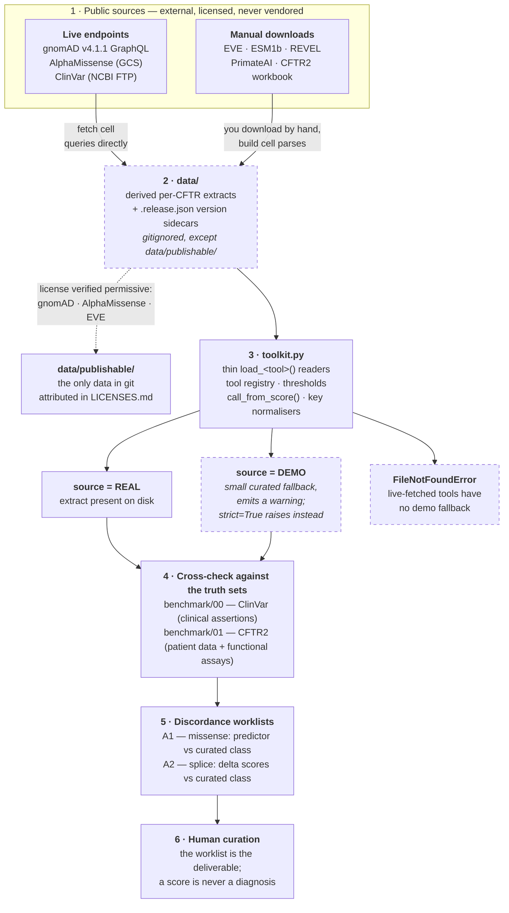

# Architecture — how a public source becomes a worklist

This is the annotated version of the diagram in the [README](../README.md#-quick-tour).
It describes what actually happens when you run a notebook in this repo, and where the
two guardrails sit: **only license-verified data crosses into git**, and **every table
is labelled REAL or DEMO**.

## Stage notes

**1 · Sources.** Every dataset is license-restricted to some degree — REVEL is
non-commercial, PrimateAI is "research use only", CFTR2 has its own data-use terms.
None of them are redistributed here. `data_manifest.json` records the exact URL,
version, checksum, and license for each.

**2 · `data/` is a boundary, not a cache.** It is gitignored by default so the licensing
question is answered before anything is published, not after. The one exception is
`data/publishable/`: three extracts whose terms were checked and found permissive
(gnomAD ODbL+MIT, AlphaMissense CC BY 4.0, EVE MIT), each attributed in
[`LICENSES.md`](../data/publishable/LICENSES.md) and enforced by CI. Note the loaders
read `data/<file>` directly, so the published copies are an offline convenience you copy
across — not a wired-up default. The `.release.json` sidecars exist because most sources have no version
string in their URL — the fetch cell records an HTTP `Last-Modified`/`ETag`, or reads a
zip member's embedded timestamp, so a silent upstream score change becomes visible as a
changed release column rather than a mystery diff.

**3 · `toolkit.py` stays thin on purpose.** It holds only what is shared across
notebooks: the loaders, the tool registry (learning type + circularity rating per
predictor), the thresholds, and the key normalisers (`hgvsp_to_short()`,
`three_to_one()`) that let protein-keyed and coordinate-keyed tools join. Each dataset's
fetch/build code lives in the notebook that owns the tool, so the recipe sits next to the
explanation of why it works that way.

**4 · The truth sets are not interchangeable.** ClinVar gives breadth; CFTR2 gives a
functional axis that no sequence model trained on. But they cross-cite each other, so
CFTR2 is only *partially* orthogonal — see
[Circularity](../README.md#circularity).

**5 · Worklists, not calls.** The output is a ranked list of variants worth a human's
attention, using deliberately simple single cut-points. Real clinical classification
applies graded thresholds and multiple evidence lines (Pejaver 2022).

## The REAL/DEMO fork

The fork at stage 3 is the design decision the rest of the repo hangs off. A loader can
return one of three things, and which one it returns depends entirely on what is on disk:

| Situation | Live-fetched tools | Manual-download tools |
|---|---|---|
| Extract present | `source='REAL'` | `source='REAL'` |
| Extract absent | raises `FileNotFoundError` | returns `source='DEMO'` + warning |
| Absent, `strict=True` | raises | raises |

The asymmetry is deliberate. A missing live-fetch is always user error — the fetch cell
takes seconds and needs no manual step — so failing loudly is right. A missing
manual-download can be legitimate (the REVEL zip is 6.5 GB), so the loader degrades to a
teaching table instead of blocking the notebook, but it never does so silently and the
`source` column carries the truth into every downstream join.
