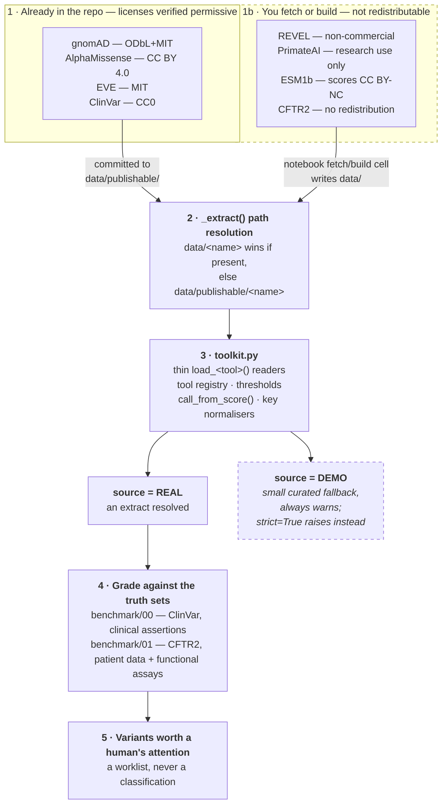

# Architecture — how a public source becomes a worklist

The annotated version of the diagram in the [README](../README.md#quick-tour). Two guardrails
run through it: **only license-verified data crosses into git**, and **every table is labelled
REAL or DEMO** so a demo value can never be mistaken for a finding.

## Stage notes

**1 · Two groups, split by the only question a reader actually has: is it already here?**
Four extracts ship because their terms permit redistribution, each attributed in
[`data/publishable/LICENSES.md`](../data/publishable/LICENSES.md) and enforced by CI. Four do
not ship, for four different reasons — non-commercial (REVEL), research-use-only (PrimateAI),
NC scores inside an MIT repo (ESM1b), and an outright prohibition on republishing or deriving
(CFTR2). `data_manifest.json` records the reasoning per dataset.

**2 · Resolution, not copying.** `_extract()` prefers a locally built `data/<name>` and falls
back to the shipped `data/publishable/<name>`. That ordering matters: re-running a fetch cell
writes `data/<name>`, and a fresher local build is never shadowed by the committed snapshot.
Resolution happens per call, so a file built mid-session is picked up without reimporting.

**3 · `toolkit.py` stays thin on purpose.** Only what is genuinely shared: the loaders, the
tool registry (learning type and circularity rating per predictor), the thresholds, and the key
normalisers (`hgvsp_to_short()`, `three_to_one()`) that let protein-keyed and coordinate-keyed
tools join. Each dataset's fetch/build code lives in the notebook that owns the tool, next to
the explanation of why it works that way.

**4 · The truth sets are not interchangeable, and not independent.** ClinVar gives breadth;
CFTR2 adds a functional axis no sequence model trained on. But they cross-cite each other, so
CFTR2 is only *partially* orthogonal — worked through in
[`tools/05_revel.ipynb`](../tools/05_revel.ipynb) §2.

**5 · Worklists, not calls.** The output is a ranked list of variants deserving human
attention, built from deliberately simple single cut-points. Real classification applies graded
thresholds and several independent lines of evidence.

## The REAL/DEMO fork

The fork at stage 3 is the design decision the rest of the repo hangs off. What a loader
returns depends entirely on what resolved at stage 2:

| Situation | Result |
|---|---|
| Extract resolved (shipped or locally built) | `source='REAL'` |
| Nothing resolved | `source='DEMO'` + a warning |
| Nothing resolved, `strict=True` | raises `FileNotFoundError` |

DEMO exists so a notebook still *runs* for a reader who has not built the restricted extracts —
not so a demo number can reach a result. That is why it always warns, why `strict=True` exists,
and why the `source` column is carried into every downstream join rather than dropped after
loading. Note DEMO deliberately does **not** feed stage 4: a curated teaching table is not
evidence, and grading a predictor against one would be meaningless.
